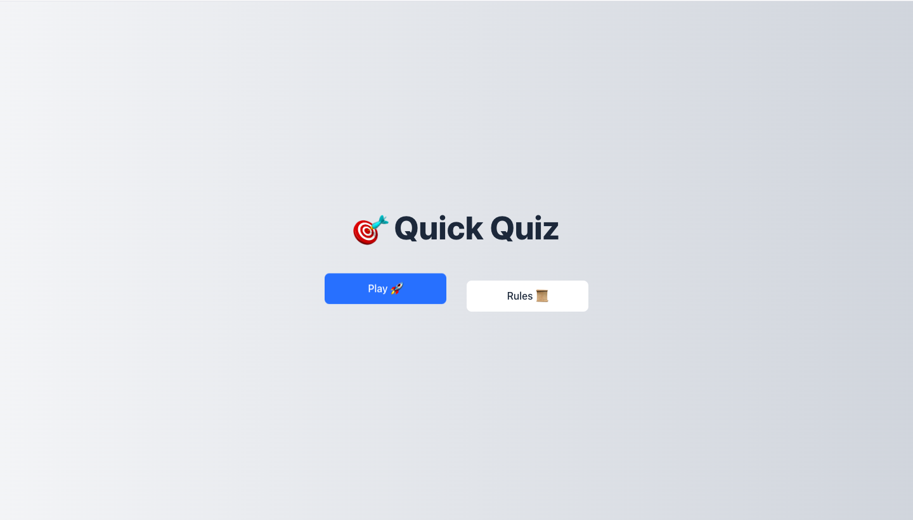
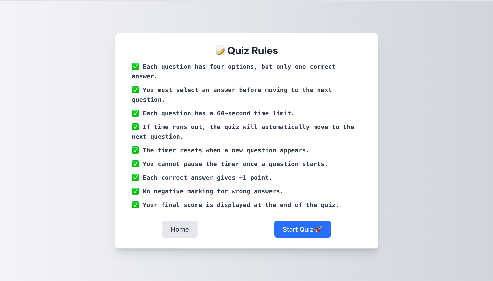
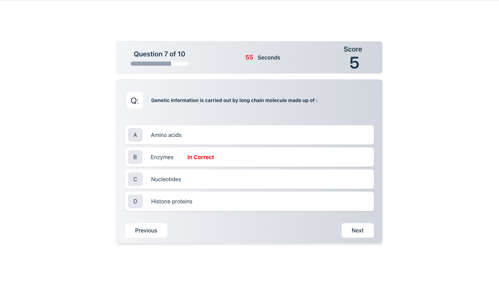

Quiz App 🎯

A web-based quiz application with gamification features built using React and Vite.

🚀 Features

Fetches quiz data from a JSON file due to CORS policy.

Multiple-choice questions with interactive UI

Displays results with scores and analysis

Gamification elements for enhanced user engagement

Responsive and intuitive design

🛠 Tech Stack

Frontend: React.js, Tailwind CSS

State Management: useState, useEffect

Build Tool: Vite

### 📸 Screenshots

Made with ❤️ by Enayat
